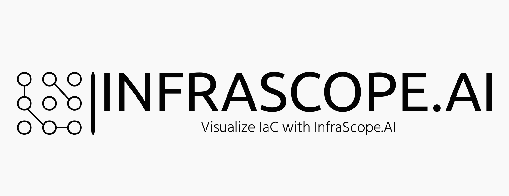

<h1 align="center"> InfraScope.AI </h1>  

## 🚩 Table of Contents

- [About](#-About)
- [Features](#-features)
- [Compatibility](#-compatibility)
- [Meet The Team](#-meet-the-team)
- [License](#-license)

## 💥 About
* Introduce InfraScope.AI , a game-changing tool that simplifies infrastructure management by converting Infrastructure-as-code into a visual and interactive architecture. Enabling you to identify and troubleshoot issues, optimize
performance, and plan for future growth with ease. Collaborate and make informed decisions faster with InfraScope.Al's user friendly interface.

## 👓 Vision
### 🎨 Features

* Visualization -  Visualizer your infrastructure
* Monitoring - Monitor your infrastructure
* Incident/Response automation - Automate your infrastructure

### 🕹 Compatibility
* Infrastructure-as-code
    
    * Terraform
    * Cloudformation

* Platforms 
    
    * Amazon Web Services (AWS)
    * Microsoft Azure
    * Google Cloud Platform
    * Kubernetes

### 🍞 Meet The Team

- [Moin Chaudhry](https://www.linkedin.com/in/moinhc/)

## 📜 License

This software is licensed under the [MIT](https://github.com/nhn/tui.editor/blob/master/LICENSE) © [NHN Cloud](https://github.com/nhn).